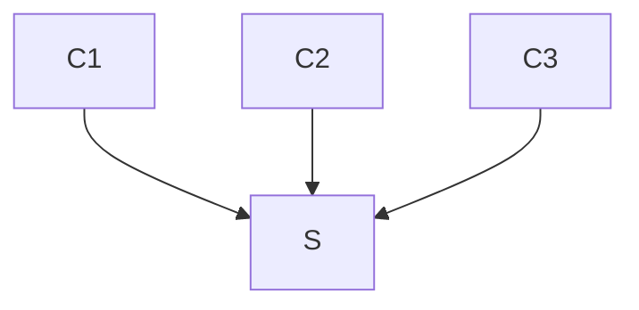

# leech



## Prerequesites

### On debian:
Dependencies:
```
sudo apt-get install autoconf automake build-essential libtool-bin check \
clang-format pkg-config libssl-dev
```

### On macOS:
Dependencies:
```
brew install autoconf automake libtool openssl check clang-format pkg-config
```

For compilers to find OpenSSL:
```
export LDFLAGS="-L$(brew --prefix openssl)/lib"
export CPPFLAGS="-I$(brew --prefix openssl)/include"
```

For pkg-config to find OpenSSL:
```
export PKG_CONFIG_PATH="$(brew --prefix openssl)/lib/pkgconfig"
```

## Install
`./bootstrap.sh && ./configure --enable-debug && make && sudo make install`


## TODO: [doxygen](https://www.gnu.org/software/autoconf-archive/ax_prog_doxygen.html)

