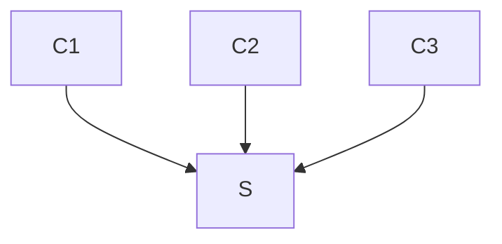

# leech

## Install
To configure, build and install from source; simply use the following command from the project root directory:
`./autogen.sh && ./configure && make && sudo make install`. To additionally compile binaries for simulation, configure with option `--enable-simulate`. Note: these simulation specific binaries are not installed using `make install`, and will only reside within the project directory.

## Commands
```
$ git clean -fx && ./autogen.sh && ./configure --enable-simulate
$ clang-format -i src/*.h src/*.c && make
$ libtool --mode=execute gdb --args ./src/node -dv
```


