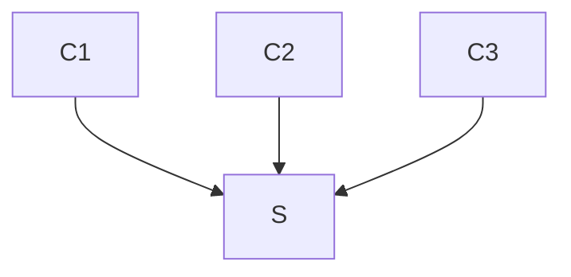

# leech

## Prerequesites
`sudo apt-get install build-essential autotools-dev autoconf libtool-bin check valgrind gdb`

## Configure
`./autogen.sh`
`./configure --enable-simulate`

## Build
`make`

## Install
`sudo make install`

## Clean
`git clean -fx`

## Format
`make format`

## Debug
`make gdb`
`make valgrind`

