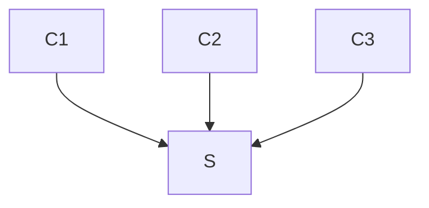

# leech

## Prerequesites
`sudo apt-get install build-essential automake autoconf libtool-bin check`

## Install
`./autogen.sh && ./configure --enable-simulate && make && sudo make install`

## TODO: [doxygen](https://www.gnu.org/software/autoconf-archive/ax_prog_doxygen.html)

