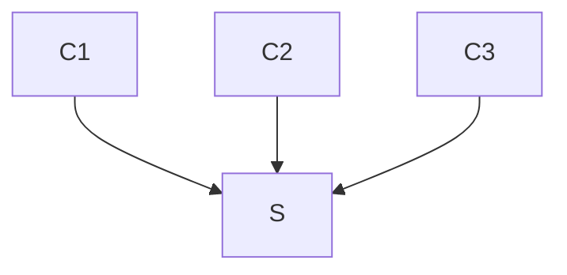

# leech




## Prerequesites

### On debian:
Dependencies:
```
sudo apt-get install autoconf automake build-essential libtool-bin check \
clang-format pkg-config
```

### On macOS:
Dependencies:
```
brew install autoconf automake libtool check clang-format pkg-config
```

## Install
```
./bootstrap.sh && ./configure --enable-debug && make && sudo make install
```

## Run unit tests with GDB
```
libtool --mode=execute gdb --args ./unit_test no-fork
```


## TODO: [doxygen](https://www.gnu.org/software/autoconf-archive/ax_prog_doxygen.html)

### Block

```json
{
    "version": "<VERSION_NUMBER>",
    "parent": "<PARENT_IDENTIFIER>",
    "timestamp": "<TIMESTAMP>",
    "payload" : [ ... ]
}
```

### Delta

```json
{
    "type": "<PAYLOAD_TYPE>",
    "version": "<VERSION_NUMBER>",
    "table": "<TABLE_IDENTIFIER>",
    "insert": {
        "<PRIMARY_KEY>": "<SUBSIDIARY_KEY>",
        ...
    },
    "update": {
        "<PRIMARY_KEY>": "<SUBSIDIARY_KEY>",
        ...
    },
    "delete": {
        "<PRIMARY_KEY>": "<SUBSIDIARY_KEY>",
        ...
    }
}
```

### Rebase

```json
{
    "type": "<PAYLOAD_TYPE>",
    "version": "<VERSION_NUMBER>",
    "id": "<TABLE_IDENTIFIER>",
    "records": [
        "<TABLE_RECORD>",
        ...
    ]
}
```
