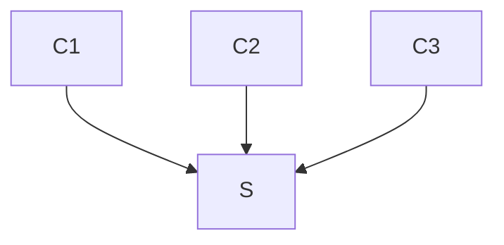

# leech

## Prerequesites
`sudo apt-get install build-essential automake autoconf libtool check`

## Install
`./autogen.sh && ./configure --enable-simulate && make && sudo make install`

```mermaid
  graph TD;
      C1-->S;
      C2-->S;
      C3-->S;
```
