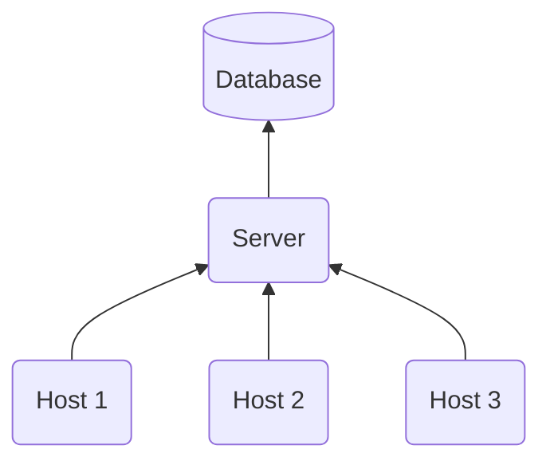
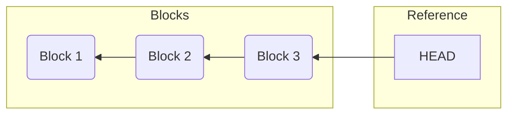

# leech

Welcome to the **leech** repository!


The **leech** library provides a method for efficient synchronization of tabular
data. The library helps you synchronize table state changes across multiple
hosts onto a centralized server. This process is optimized for efficiency by
only transmitting the necessary data required to replicate the end state of the
recorded changes from a host onto the server.



**leech** consists of a handful primary functions: `LCH_Commit()`, `LCH_Diff()`,
`LCH_Patch()`, `LCH_Rebase()`, `LCH_History()` and `LCH_Purge()`, all located
within `leech.h`. In the following sections, we'll delve into the mechanics of
each function. This will help to provide you with a greater insight into the
workings of **leech**.

## LCH_Commit()

Whenever changes are made to a system, these changes can be recorded by calling
`LCH_Commit()`. Its operation involves the computation of deltas by leveraging
the system's current- and previous state.

### Loading states

Table states are loaded as two-dimensional lists. The first one (referred to as
"the old state") is loaded as a snapshot, internally stored during the previous
call to `LCH_Commit()`. While the second one (referred to as "the new state") is
loaded through the use of [callback functions](#callback-functions).

```json5
[ // Old state
  [ "foo", "bar", "baz", "qux" ],
  [ "A",   "B",   "1",   "2"   ],
  [ "C",   "D",   "3",   "4"   ],
  [ "E",   "F",   "5",   "6"   ]
]
```

```json5
[ // New state
  [ "foo", "bar", "baz", "qux" ],
  [ "A",   "B",   "1",   "2"   ],
  [ "C",   "D",   "3",   "4"   ],
  [ "E",   "F",   "5",   "6"   ]
]
```

### Transforming states

From two-dimensional lists, **leech** transforms these tables into hash maps to
achieve efficient indexing based on the table's composite primary key (hereby
referred to as primary fields). The primary fields are defined in the [table
definition](#table-definition), along with subsidiary fields (which consist of
all non-primary fields). You'll learn more about table definitions later. In the
meanwhile, both the primary- and subsidiary fields are composed into CSV
records, which are used as key-value pairs - respectively - as entries in these
hash maps.

```json5
{ // Old state
  "A,B": "1,2",
  "C,D": "3,4",
  "E,F": "5,6"
}
```

```json5
{ // New state
  "A,C": "1,2",
  "C,D": "3,4",
  "E,F": "5,5"
}
```

### Computing deltas

Next, a delta containing insert-, delete-, and update operations are computed
based on the two hash maps. Inserts include all entries where keys are
exclusively present in the new state. Whereas, deletes include all entries where
keys are exclusively present in the old state. Lastly, updates contain all
entries present in both states, but where the value differs.

```json5
{ // Delta
  "type": "delta",  // Type of payload
  "id": "foo",      // Unique table identifier
  "inserts": {
    "A,C": "1,2"
  },
  "deletes": {
    "A,B": "1,2"
  },
  "updates": {
    "E,F": "5,5"
  }
}
```

### Creating blocks

For each delta computed based on tables defined in the [config
file](#config-file), they are appended to the payload of a block.

```json5
{ // Block
  "timestamp": 1714138971,  // Time of block creation
  "version": 1,             // Block version number
  "parent": "03190eb6533d86b36339aac4ced5e1ec79770b6d",
  "payload": [
    // Delta
  ]
}
```

### Block chain

The block is then stored as a file named according to its message digest using
the SHA-1 algorithm. A special file called `HEAD` is then updated to hold a
reference to the new block, which is now at the head of the chain.



## LCH_Diff()

The `LCH_Diff()` function serves as a tool for consolidating multiple blocks
into one unified block by merging their deltas and returning it as a patch.

### Creating patch

The algorithm operates by initially loading the block at the head of the chain.
It then proceeds with a recursive process of merging the current block with the
block referenced as its parent. Recursion ends once the last known block is
reached and the unified block is returned. The unified block is then appended to
a patch along with the new reference to the last-known block, which now points
the block at the head of the chain.

```json5
{ // Patch
  "timestamp": 1714392688,  // Timestamp of patch creation
  "version": 1,             // Patch version number
  "lastknown": "3d552af2070362fd9ed47d54bb6d3018d067025d",
  "blocks": [
    // One merged block
  ]
}
```

> The observant reader may ask why a single block is returned in a list. The
reason for this is that we want to keep the possibility open for disabling the
merging of blocks for some tables in future iterations of **leech**. For some
tables, the intermediate values may be important to detect. However, if you are
only interested in the intermediate values of a record, then
[`LCH_History()`](#lch_history) might be a better solution.

### Merging rules

| Rule | Parent              | Child               | Result              |
|------|---------------------|---------------------|---------------------|
|   1  |                     | `insert(key, val)`  | `insert(key, val)`  |
|   2  |                     | `delete(key, val)`  | `delete(key, val)`  |
|   3  |                     | `update(key, val)`  | `update(key, val)`  |
|   4  | `insert(key, val)`  |                     | `insert(key, val)`  |
|   5  | `insert(key, X)`    | `insert(key, X)`    | `error(key)`        |
|   6a | `insert(key, val)`  | `delete(key, val)`  |                     |
|   6b | `insert(key, val)`  | `delete(key, null)` |                     |
|   6c | `insert(key, val1)` | `delete(key, val2)` | `error(key)`        |
|   7  | `insert(key, val1)` | `update(key, val2)` | `insert(key, val2)` |
|   8  | `delete(key, val)`  |                     | `delete(key, val)`  |
|   9a | `delete(key, val)`  | `insert(key, val)`  |                     |
|   9b | `delete(key, val1)` | `insert(key, val2)` | `update(key, val2)` |
|  10  | `delete(key, X)`    | `delete(key, X)`    | `error(key)`        |
|  11  | `delete(key, X)`    | `update(key, X)`    | `error(key)`        |
|  12  | `update(key, val)`  |                     | `update(key, val)`  |
|  13  | `update(key, X)`    | `insert(key, X)`    | `error(key)`        |
|  14a | `update(key, val)`  | `delete(key, val)`  | `delete(key, null)` |
|  14b | `update(key, val1)` | `delete(key, null)` | `delete(key, null)` |
|  14c | `update(key, val1)` | `delete(key, val2)` | `error(key)`        |
|  15  | `update(key, X)`    | `update(key, val)`  | `update(key val)`   |

The merging of deltas happens according to 15 rules, where some have subrules
(depicted by the letters a, b, and c). Rules 1-4, 8, and 12 address the
scenarios where a specific key is exclusively present in one block. In these
instances, no conflicts arise, and the delta operation is seamlessly transferred
to the resulting block. The remaining rules tackle the conflicts arising where a
specific key is present in both blocks. Rules 5, 10-11, and 13 encompass
unresolvable conflicts and issue an error without even checking the values of
the key-value pair, depicted by `X` (it can be read as "I don't care").

Rule 14a shows a special case, where if we update a record and then delete it,
it should result in the record being deleted. However, since we currently don't
know what the value was before we updated it, we must put `null` as a
placeholder (it can be read as "I don't know"). Inevitability, we also have to
handle the cases where the value of a key-value pair is `null`. For example,
rule 14c emits an error if there is an update followed by a delete, where the
value differs, depicted by `val1` and `val2`. However, rule 14b protects against
the case, where we simply don't know what the value was.

With all this in mind, the remaining rules should be self-explainatory.

## LCH_Rebase()

If **leech** fails for any reason, it should be able to recover. The
`LCH_Rebase()` function is made for this purpose. Similar to
[`LCH_Commit()`](#lch_commit) it generates a block. The difference is that it
compares the previous state to an empty table, and sets the payload type to
`"rebase"`. This way, it will consist of insert operations for each record in
each table. Yes, this is quite an expensive operation. However, it should ideally
never happen, but in practice, it will happen on rare occasions.

```json5
{ // Rebase
  "type": "rebase",
  "id": "foo",
  "inserts": {
    "A,C": "1,2",
    "C,D": "3,4",
    "E,F": "5,5"
  },
  "deletes": {},
  "updates": {}
}
```

Instead of saving the block to disk, like [`LCH_Commit()`](#lch_commit) does,
`LCH_Rebase()` immediately appends the block to a patch, similar to
[`LCH_Patch()`](#lch_patch). However, it does not iterate the blockchain or
merge any blocks.

## LCH_Patch()

The patch function is easy. Once the server acquires a patch generated by
[`LCH_Diff()`](#lch_diff) or [`LCH_Rebase()`](#lch_rebase) on the client, it
parses the patch and applies the operations on its own copy of the tables.

The following pseudo-code roughly shows how the `LCH_Patch()` function operates,
where each of the function calls can be tied to a [callback
function](#callback-functions):

```
 1.  for each table in patch:
 2.    connect()
 3.    create_table()
 4.    begin_transaction()
 5.
 6.    if type is rebase:
 7.      truncate_table()
 8.
 9.    apply_deletes()
10.    apply_updates()
11.    apply_inserts()
12.
13.    if error:
14.      rollback_transaction()
15.    else:
16.      commit_transaction()
17.
18.    disconnect()
```

## LCH_History()

As mentioned before, the intermediate value of a record may be important to
detect. In this case, you can have the client execute the `LCH_History()`
function to query the entire history of a record, given its primary composite
key. The `LCH_History()` function operates by iterating the blockchain and
checking the existence of that primary key in the delta.

For example, the history of a record with the primary key `bogus,doofus` for
table `foo` could look something like this:

```json5
{ // History
  "table_id": "foo",
  "to": 1714483806,
  "from": 0,
  "primary": {
    "foo": "bogus",
    "bar": "doofus"
  },
  "history": [
    {
      "timestamp": 1714392897,
      "subsidiary": {
        "baz": "0",
        "qux": "509.23"
      },
      "operation": "insert",
      "block_id": "fbb0796f558e24c8d8902d84a70b959e797bfc9a"
    },
    {
      "timestamp": 1714392809,
      "subsidiary": {
        "baz": "0",
        "qux": "163.10"
      },
      "operation": "update",
      "block_id": "65e1ae9e672e03e5da488ffdcdf000c92f020514"
    },
    {
      "timestamp": 1714392705,
      "subsidiary": {
        "baz": "0",
        "qux": "163.10"
      },
      "operation": "delete",
      "block_id": "3d5bd74a03accdaa667ce61704e75042e59c74c1"
    }
  ]
}
```

If you however want intermediate changes for an entire table, please check out
the section on [disabling merging of blocks](#disable-merging-blocks).

## LCH_Purge()

For each block created by a call to [`LCH_Commit()`](#lch_commit), a new file is
created on the disk to store the block information. At some point, these blocks
may add up to take up a considerable amount of disk space. To prevent this, the
`LCH_Purge()` function can be used to delete old blocks. It operates by
iterating over the first N blocks (configurable in the [config
file](#config-file)), whitelisting them from deletion. **leech** then proceeds
by deleting all remaining (non-whitelisted) blocks from the disk to
free up disk space. This operation is quite expensive in terms of CPU cycles.
Hence, normally it should be scheduled to execute at a regular interval, instead
of after each commit. However, if the configured desired chain length is small,
you can consider running it after each commit by enabling auto purge in the
[config file](#config-file).

## Config file

Each of the primary **leech** functions start off by loading and parsing a
configuration file in the working directory. The simplest configuration file can
look like this. It has one attribute, "tables," in which [table
definitions](#table-definition) can be added. These are required for **leech**
to do anything useful. More on that later.

```json5
{ // Config
  "tables": {
    // Table definitions
  }
}
```

### Pretty printing

**leech** generates snapshots, blocks, and patches in a JSON-like format. By
default, no whitespaces are printed, to preserve disk space and
bandwidth consumption. While debugging **leech**, it can be quite tedious to
iterpret these files. By setting the pretty print option to true, these objects
will be nicely formatted.

```json5
{ // Config
  "pretty_print": true,
  "tables": {
    // Table definitions
  }
}
```

### Desired chain length

As mentioned in [`LCH_Purge()`](#lch_purge), the desired chain length can be
configured in the config file. In the example below, we set the desired chain
length to 3. Meaning that a call to [`LCH_Purge()`](#lch_purge) would purge
blocks further than three blocks away from the head of the chain.

```json5
{ // Config
  "chain_length": 3,
  "tables": {
    // Table definitions
  }
}
```

### Auto purging

As the [`LCH_Purge()`](#lch_purge) function is quite expensive in terms of CPU
cycles, auto-purging is generally not advised. However, if the [desired chain
length](#desired-chain-length) is small, auto-purging can be feasible. If
auto-purging is enabled as in the example below, then a call to
[`LCH_Commit()`](#lch_commit) will be automatically followed by a call to
[`LCH_Purge()`](#lch_purge).

```json5
{ // Config
  "auto_purge": true,
  "tables": {
    // Table definitions
  }
}
```

## Table definition

For **leech** to do anything useful, table definitions are required. Table
definitions are a series of key-value pairs, where the key is a table identifier,
that is used internally by **leech**. This table identifier must be unique, and
is normally short, to avoid unnecessary bandwidth consumption. The value
is an object containing multiple configuration parameters.

```json5
{
  "BTL": {
    "primary_fields": ["first_name", "last_name"],
    "subsidiary_fields": ["born"],
    "merge_blocks": false, // Optional (default: true)
    "source": {
      "params": "beatles.csv",
      "schema": "leech",
      "table_name": "beatles",
      "callbacks": "lib/leech_csv.so",
    },
    "destination": {
      "params": "dbname=leech",
      "schema": "leech",
      "table_name": "beatles",
      "callbacks": "lib/leech_psql.so",
    }
  }
}
```

### Primary fields

The `"primary_fields"` parameter should contain a non-empty list of the column
names that make up the primary composite key. These fields must uniquely
identify a record. I.e., there cannot be more than one record with the same
composite primary key.

### Subsidiary fields

The `"subsidiary_fields"` parameter should contain the column names of the
remaining fields to be loaded by **leech**. This can be the empty list, in case
all fields make up the primary composite key.

### Disable merging blocks

In some situations it's important to keep track of intermediate values. We
already know that we can get an intermediate value from a specific record using
[`LCH_History()`](#lch_history). However, you may want this for an entire table.
In this case, you can set the `"merge_blocks"` parameter to `false` (it defaults
to `true`) in the respective table definition. This completly disables [merging
of blocks](#merging-blocks) for that table. Causing multiple blocks to be
included in the patch. Other tables are however, merged into the last block.

### Source / Destination parameters

**leech** uses two sets of callback functions. One is to retrieve tables on the
client (i.e., the source parameters), and the other is to apply changes on the
server (i.e., the destination parameters). The `"callbacks"` parameter specifies
the location of the callback functions to be dynamically loaded. The remaining
parameters specify information to be passed as arguments to these callback
functions. E.g., connection string, table name, schema name.

## Callback functions

**leech** is not responsible for fetching tables or applying changes to them.
This is your job, as a user of the library. To do this, you need to implement
callback functions. You can use [leech_csv.c](lib/leech_csv.c) or
[leech_psql.c](lib/leech_psql.c) as examples to create something that fits your
needs.

You should find the required definitions needed for the callback functions in
`leech.h`. If you compile with a C++ compiler, you will also need to surround
your callback implementations with `extern "C"` as illustrated below.

```C
#include <leech.h>

#ifdef __cplusplus
extern "C" {
#endif

// Callback functions here ...

#ifdef __cplusplus
}
#endif
```

### LCH_CallbackConnect()

```C
/**
 * @brief Responisble for connecting to a database.
 * @param conn_info C-string containing the value of the "params" attribute in
 *                  the respective table definition.
 * @return Connection object or NULL in case of error.
 */
void *LCH_CallbackConnect(const char *conn_info);
```

### LCH_CallbackDisconnect()

```C
/**
 * @brief Responsible for closing the database connection and releasing any
 *        other allocated resources.
 * @param conn Database connection object.
 */
void LCH_CallbackDisconnect(void *conn);
```

### LCH_CallbackCreateTable()

```C
/**
 * @brief Responsible for creating the respective table if it does not exist.
 * @param conn Database connection object.
 * @param table_name C-string containing the "table_name" in the respective
 *                   table definition.
 * @param primary_columns List of LCH_Buffer's contating the column names of the
 *                        primary fields.
 * @param subsidiary_columns List of LCH_Buffer's containing the column names of
 *                           the subsidiary fields.
 * @return True on success, otherwise false.
 */
bool LCH_CallbackCreateTable(void *conn, const char *table_name,
                             const LCH_List *primary_columns,
                             const LCH_List *subsidiary_columns);
```

### LCH_CallbackTrunctateTable()

```C
/**
 * @brief Responsible for deleting records from a specific host.
 * @param conn Database connection object.
 * @param table_name C-string containing the "table_name" in the respective
 *                   table definition.
 * @param column C-string containing the column name for host identifiers.
 * @param value C-string containing the host identifier to delete records from.
 * @return True on success, otherwise false.
 */
bool LCH_CallbackTruncateTable(void *conn, const char *table_name,
                               const char *column, const char *value);
```

### LCH_CallbackGetTable()

```C
/**
 * @brief Responsible for getting the current state of a table.
 * @param conn Database connection object.
 * @param table_name C-string containing the "table_name" in the respective
 *                   table definition.
 * @param columns List of LCH_Buffer's contating all column names.
 * @return A row-based two-dimensional list of LCH_Buffer's. The first row must
 *         contain the passed columns names. NULL should be returned in case of
 *         error.
 */
LCH_List *LCH_CallbackGetTable(void *conn, const char *table_name,
                               const LCH_List *columns);
```

### LCH_CallbackBeginTransaction()

This function is responsible for starting a transaction. The connection object
is passed as the only argument. On success the functions should return `true`.
Otherwise, it should return `false`.

```C
/**
 * @brief Responsible for starting a transaction.
 * @param conn Database connection object.
 * @return True on success, otherwise false.
 */
bool LCH_CallbackBeginTransaction(void *conn);
```

### LCH_CallbackCommitTransaction()

```C
/**
 * @brief Responsible for commiting a transaction.
 * @param conn Database connection object.
 * @return True on success, otherwise false.
 */
bool LCH_CallbackCommitTransaction(void *conn);
```

### LCH_CallbackRollbackTransaction()

```C
/**
 * @brief Responsible for rolling back a transaction.
 * @param conn Database connection object.
 * @return True on success, otherwise false.
 */
bool LCH_CallbackRollbackTransaction(void *conn);
```

### LCH_CallbackInsertRecord()

```C
/**
 * @brief Responsible for inserting a record in the table.
 * @param conn Database connection object.
 * @param table_name C-string containing the "table_name" in the respective
 *                   table definition.
 * @param columns List of LCH_Buffer's contating the column names.
 * @param values List of LCH_Buffer's the record values.
 * @return True on success, otherwise false.
 */
bool LCH_CallbackInsertRecord(void *conn, const char *table_name,
                              const LCH_List *columns,
                              const LCH_List *values);
```

### LCH_CallbackDeleteRecord()

```C
/**
 * @brief Responsible for deleting a record in the table.
 * @param conn Database connection object.
 * @param table_name C-string containing the "table_name" in the respective
 *                   table definition.
 * @param columns List of LCH_Buffer's contating the column names of the primary
 *                fields.
 * @param values List of LCH_Buffer's the record values of the primary fields.
 * @return True on success, otherwise false.
 */
bool LCH_CallbackDeleteRecord(void *conn, const char *table_name,
                              const LCH_List *columns,
                              const LCH_List *values);
```

### LCH_CallbackUpdateRecord()

```C
/**
 * @brief Responsible for updating a record in the table.
 * @param conn Database connection object.
 * @param table_name C-string containing the "table_name" in the respective
 *                   table definition.
 * @param primary_columns List of LCH_Buffer's contating the column names of the
 *                        primary fields.
 * @param primary_values List of LCH_Buffer's the record values of the primary
 *                       fields.
 * @param subsidiary_columns List of LCH_Buffer's contating the column names of
 *                           the subsidiary fields.
 * @param subsidiary_values List of LCH_Buffer's the record values of the
 *                          subsidiary fields.
 * @return True on success, otherwise false.
 */
bool LCH_CallbackUpdateRecord(void *conn, const char *table_name,
                              const LCH_List *primary_columns,
                              const LCH_List *primary_values,
                              const LCH_List *subsidiary_columns,
                              const LCH_List *subsidiary_values);
```
