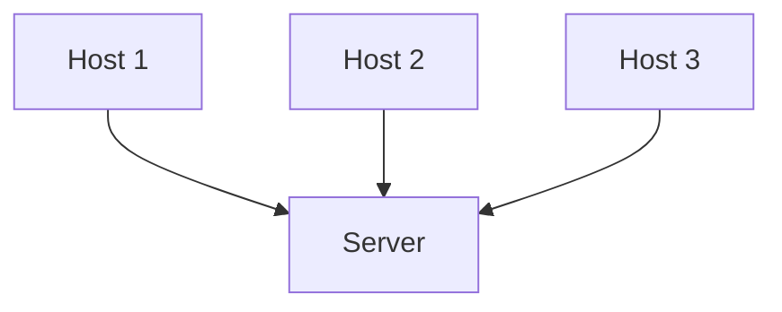

# leech

Welcome to the **leech** repository!


The **leech** library provides a method for efficient synchronization of tabular
data. It allows you to synchronize table state changes across multiple hosts on
to a centeralized server. This process is optimized for efficiency by only
transmitting the necessary data required in order to replicate end state of
the recorded changes on a host, onto the server.



```mermaid
    graph TD;
        H1[Host 1]-->S[Server];
        H2[Host 2]-->S[Server];
        H3[Host 3]-->S[Server];
```

**leech** consists of four primary functions: `LCH_Commit()`, `LCH_Delta()`,
`LCH_Rebase()` and `LCH_Patch()`, all located within `leech.h`. In the
following sections, we'll delve into the mechanics of each function, in order to
provide you with a greater insight into the workings of **leech**.

## Commit

When ever changes are made to a system, these changes can be recorded by calling
`LCH_Commit()`. Its operation involves the computation of deltas by leveraging
the current- and previous states. States are loaded as two dimantional,
`NULL`-terminated, string arrays.

```C
char ***old_state = {
    { "foo", "bar", "baz", "qux", NULL },
    { "A",   "B",   "1",   "2",   NULL },
    { "C",   "D",   "3",   "4",   NULL },
    { "E",   "F",   "5",   "6",   NULL },
    NULL,
};
char ***new_state = {
    { "foo", "bar", "baz", "qux", NULL },
    { "A",   "B",   "1",   "2",   NULL },
    { "C",   "D",   "3",   "4",   NULL },
    { "E",   "F",   "5",   "6",   NULL },
    NULL,
};
```

**leech** transforms these tables into hash maps in order to achieve effiecient
indexing based on the table's composite primary key.

**Old State:**
```json
{
    "old_state": {
        "A,B": "1,2",
        "C,D": "3,4",
        "E,F": "5,6",
    },
    "new_state": {
        "A,C": "1,2",
        "C,D": "3,4",
        "E,F": "5,5",
    }
}
```

```json
{
    "inserts": {
        "A,C": "1,2"
    },
    "deletes": {
        "A,B": "1,2"
    },
    "updates": {
        "E,F": "5,5"
    }
}
```


## Prerequesites

### On debian:
Dependencies:
```
sudo apt-get install autoconf automake build-essential libtool-bin check \
clang-format pkg-config
```

### On macOS:
Dependencies:
```
brew install autoconf automake libtool check clang-format pkg-config
```

## Install
```
./bootstrap.sh && ./configure --enable-debug && make && sudo make install
```

## Run unit tests with GDB
```
libtool --mode=execute gdb --args ./unit_test no-fork
```


## TODO: [doxygen](https://www.gnu.org/software/autoconf-archive/ax_prog_doxygen.html)

### Block

```json
{
    "version": "<VERSION_NUMBER>",
    "parent": "<PARENT_IDENTIFIER>",
    "timestamp": "<TIMESTAMP>",
    "payload" : [ ... ]
}
```

### Delta

```json
{
    "type": "<PAYLOAD_TYPE>",
    "version": "<VERSION_NUMBER>",
    "table": "<TABLE_IDENTIFIER>",
    "insert": {
        "<PRIMARY_KEY>": "<SUBSIDIARY_KEY>",
        ...
    },
    "update": {
        "<PRIMARY_KEY>": "<SUBSIDIARY_KEY>",
        ...
    },
    "delete": {
        "<PRIMARY_KEY>": "<SUBSIDIARY_KEY>",
        ...
    }
}
```

### Rebase

```json
{
    "type": "<PAYLOAD_TYPE>",
    "version": "<VERSION_NUMBER>",
    "id": "<TABLE_IDENTIFIER>",
    "records": [
        "<TABLE_RECORD>",
        ...
    ]
}
```
